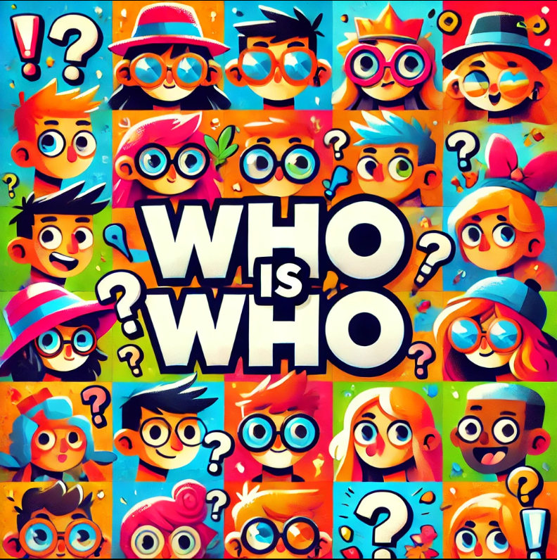

<p align="center">
    
</p>

## **Tabla de Contenidos**

- [**Introducción**](#introducción)
- [**Manual**](#manual)
    - [**Instalación**](#instalación)
    - [**Uso**](#uso)
- [**Metodología**](#metodología)
- [**Descripción Técnica**](#descripción-técnica)
    - [**Historias de Usuario**](#historias-de-usuario)
    - [**Arquitectura de la Aplicación**](#arquitectura-de-la-aplicación)
- [**Implementación**](#implementación)
    - [**Tecnologías y Herramientas Elegidas**](#tecnologías-y-herramientas-elegidas)
- [**Tiempo invertido**](#tiempo-invertido)
- [**Conclusiones**](#conclusiones)
    - [**Posibles Mejoras**](#posibles-mejoras)
    - [**Dificultades**](#dificultades)

# **Introducción**

Proyecto de 1ºDAM desarrollado por **[Alexander Gil](https://github.com/AlexanderGilMarin)** y **[Edgar Gómez](https://github.com/edgargomezz)**. El proyecto consiste en crear un juego de ¿Quién es Quién? utilizando el framework open source **[Reflex](https://reflex.dev/)**.   
Este framework fue seleccionado por nuestro Product Owner debido a su facilidad.

# **Manual**
## **Instalación**
Para instalar el juego, crea una carpeta para guardarlo y usa estos comandos:


```
mkdir ./el_nombre_que_querais
cd ./el_nombre_que_querais
```

Luego, debemos clonar el repositorio de GitHub
```
git clone https://github.com/AlexanderGilMarin/Quien-es-Quien.git
```

instalamos el entorno virtual, 

**Versión Linux**
```
python3 -m venv .venv
source .venv/bin/activate
```
**Versión Windows**
```
py -3 -m venv .venv
.venv\\Scripts\\activate
```

Ejecuta este comando para instalar todos los paquetes requeridos para la aplicación:
```
pip install -r requirements.txt
```

Una vez completados los pasos anteriores, puedes iniciar la aplicación ejecutando:
```reflex run```.
---  
## **Pre-requisitos**
-   `Git`
-   `Python`
-   `reflex`
-   `pytest`

## Uso
**1. Una vez instalada la aplicacion y puesto todos los comandos,entraremos al localhost que se nos ha proporcionado**

**2. Dentro de la pagina web veras un boton que te dira "Comenzar juego"**

**3. Veras un cambio y apareceran los personajes y un chat**

**4. Ya puedes jugar**

# **Metodología**
La metodología que utilizamos para este código fue, para el **frontend**, el uso de **Reflex**, ya que esta biblioteca contaba con numerosos componentes predefinidos, lo que facilitó considerablemente el trabajo. Además, al ser una herramienta orientada a la creación de interfaces interactivas, permitió centrarnos en la lógica del juego sin tener que preocuparnos demasiado por los detalles de la interfaz. Para el **backend**, empleamos técnicas estándar de programación para gestionar el estado del juego y la interacción entre el usuario y el sistema.


# **Descripción Técnica**
La aplicación, desarrollada con el framework Reflex, toma como referencia el clásico juego de ¿Quién es quién?
En el cual es un tablero con unos personajes, de los cuales a base de preguntas tienes que conseguir adivinar el personaje que se ha escogido aleatoriamente por el codigo.


## **Requisitos funcionales/no funcionales, NOT LIST**
Requisistos funcionales: Iniciar una partida: El usuario debe poder iniciar una partida al hacer clic en el botón "Comenzar Juego", lo que dispara la función iniciar_juego().

Requisitos no funcionales: Rendimiento: El juego debe funcionar de manera fluida, sin retrasos, al manejar interacciones del usuario como preguntas y cambios de estado del juego.

IN SCOPE: En el tablero, cada personaje se representa con su nombre y una imagen. Los personajes eliminados tienen opacidad reducida.

OUT SCOPE: Soporte para múltiples jugadores en tiempo real: El juego está diseñado para un solo jugador en su forma actual. No se contempla la jugabilidad en línea o con múltiples jugadores.

UNRESOLVED: Historial de partidas: No se ha resuelto cómo almacenar un registro completo de las partidas jugadas (por ejemplo, ganadas/perdidas, personajes adivinados, etc.). Esto podría añadirse en el futuro para hacer un seguimiento de las sesiones del juego.


## **Historias de usuario**
Botón para iniciar una nueva partida
Como usuario, quiero tener un botón para iniciar una nueva partida, para poder comenzar una nueva sesión de juego sin tener que reiniciar la aplicación manualmente. Esto permite que el personaje se elija aleatoriamente para cada nueva partida, facilitando la jugabilidad.

Chat para realizar preguntas
Como jugador, necesito un chat donde pueda hacer preguntas a fin de jugar correctamente al "Quién es quién". Las preguntas son esenciales para descubrir la identidad del personaje y avanzar en el juego. Sin este chat, el juego no sería jugable.

Eliminar personajes de la lista
Como usuario, quiero la posibilidad de eliminar personajes de la lista mientras juego, para que la experiencia sea más cómoda y fluida. Esto permite reducir las opciones de forma eficiente conforme avanzan las preguntas, mejorando la jugabilidad.

Selección aleatoria de un personaje
Como jugador, necesito que se seleccione un personaje aleatoriamente al iniciar cada partida. Esta funcionalidad es indispensable para que el usuario pueda empezar el juego con un personaje asignado, lo que facilita el proceso de realizar preguntas y ganar la partida.


## **Arquitectura de la aplicación**

*Configuraciones y requerimientos*
- **/assets** : Guardamos las imagenes necesarias,
- **/rxconfig.py** : Configuracion de reflex,
- **/requirements.txt** : En este .txt se encuentran las dependencias,
- **/test** : Aqui se encuentran los casos test.

*Front y backend*
- **/Quien_es_Quien/personaje_aleatorio.py** : Se encuentra la lista de los personajes, con sus caracteristicas y ruta de imagen, y la funcion para que escoja un personaje aleatoriamente
- **/Quien_es_Quien/Quien_es_Quien** : El juego, no separamos front y backend(error nuestro), por lo cual en este archivo encontraras el codigo con sus funciones.
- **/Quien_es_Quien/style/style.py** : Estilos.


## **Diagrama de casos de uso**


## **Diagrama de Componentes**


# **Implementación**
## **Tecnologías y Herramientas Elegidas**
- [Reflex](https://reflex.dev/)
    - Este framework fue seleccionado por nuestro Product Owner (profesor) para llevar a cabo el desarrollo del proyecto.
- [Python](https://www.python.org/)
    - [Pytest](https://docs.pytest.org/en/stable/) 
        - Biblioteca esencial para los casos test


# **Tiempo invertido**
## **Wakatime**


nos faltan capturas y tuvimos algun problema con el wakatime porque no nos cogia el tiempo correcto y a veces no recogia el tiempo.
Pero el tiempo rondara al rededor de 50 horas.

# **Conclusiones**
Nos gustaria implementar mas cosas, pero con el tiempo que tuvimos y el conocimiento fue hasta donde pudimos llegar.
Por lo general ha sido una experiencia nueva esto de programar un trabajo de este calibre. 
## **Posibles mejoras**
Hay muchas cosas por mejorar, como ya mencione es nuestro primer proyecto, deberiamos haber creado 2 ramas o mas, separar el backend y frontend, la organizacion nos costo al principio, miraremos al pasado y mejoraremos para el futuro.
## **Dificultades**
Al principio tuvimos dificultades con la logica para responder las preguntas porque la logica que teniamos era un poco ambigua, ya que a veces preguntabas si era un personaje te lo tomaba como una caracteristica y viceversa, tambien tuvimos dificultades con el evento para que desaparecieran los personajes cuando no tenian la caracteristica preguntada.